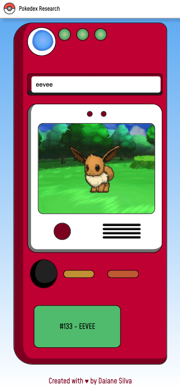
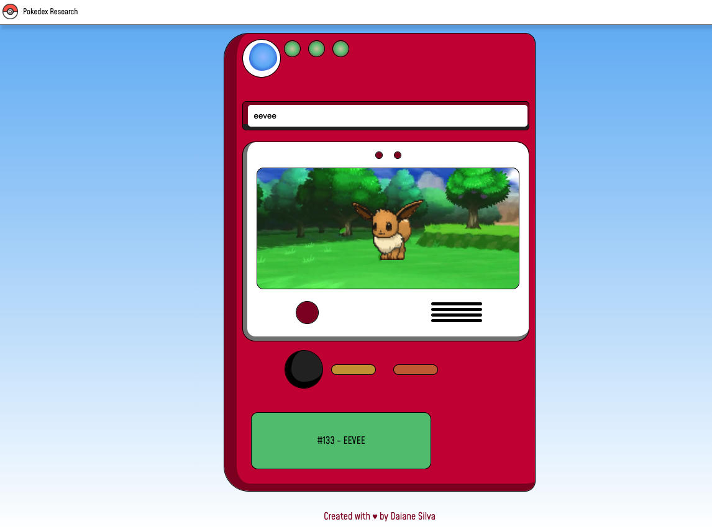

# Pokedex Client with BFF

This project is a frontend client with a Backend for Frontend (BFF) architecture built using [Next.js](https://nextjs.org/), [Typescript](https://www.typescriptlang.org/), [`next/font`](https://nextjs.org/docs/basic-features/font-optimization) and [Sass](https://sass-lang.com/). It consumes the Restful version of the [PokeApi](https://pokeapi.co/) to provide a rich and interactive experience for users.

## Design

### Mobile



### Desktop



## Requirements

- [Node.js](https://nodejs.org/) v20
- [npm](https://www.npmjs.com/) v10

## Getting Started

To get the project up and running, follow these steps:

```bash
npm ci
npm run dev
# or
npm ci
npm run build
npm run start
```

## Running Tests

To run the test cases:

```bash
npm run test
```

To run the tests in watch mode:

```bash
npm run test:watch
```

To check the test coverage:

```bash
npm run coverage
```

Note: The test coverage for this project is at 100%.

## Generating Components

To generate new components, you can use the following command:

```bash
npm run generate
```

Follow the prompts to enter the name of the component. The component will be automatically generated inside the components directory using Plop.js.

## License

This project is licensed under the MIT License.
